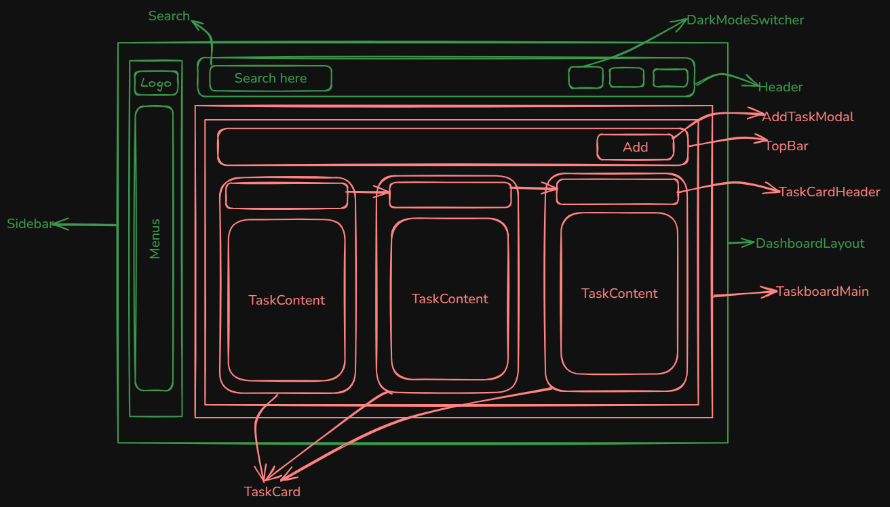
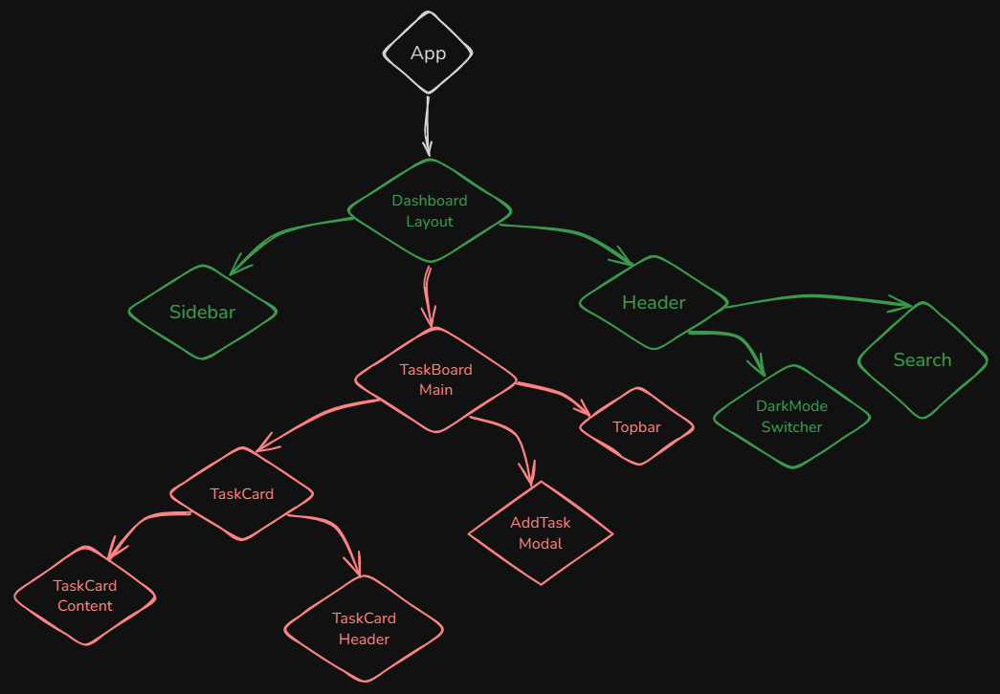

# 🏠 **Assignment-3: Project Manager**

An easy-to-use application for managing personal tasks. Users can add, edit, and delete tasks, as well as view a summary of their to-do list.

## **Features**

- **Add Task**: Create a new task with a title, description, date, and category.
- **Edit Task**: Update existing tasks using the same form.
- **Delete Task**: Remove tasks from the list.
- **Search**: Filter tasks by title using a search bar.
- **Sort**: Sort tasks by date within each category.
- **Empty State**: Display a message "Task List is empty!" when there are no tasks.

## **Technologies Used**

- **React.js**
- **Tailwind CSS**
- **Vite**

## **Component Diagram**

## **Component Tree**

## 🚀 **Live Demo**

Check out the live version of the website: [Project Manager](https://assignment3-project-manager-u5sp.vercel.app/)
