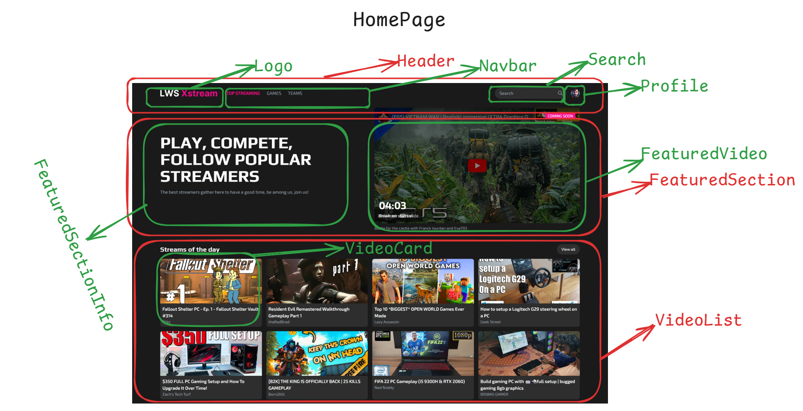
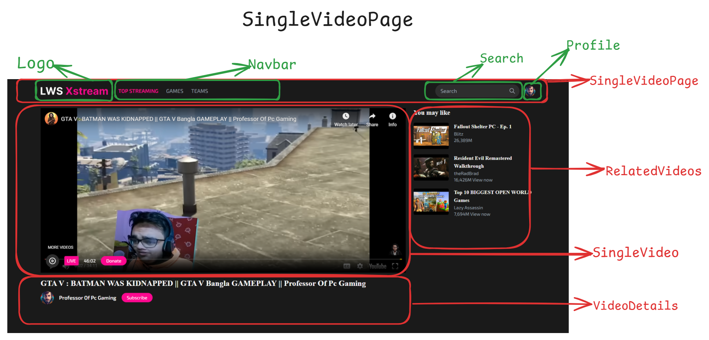
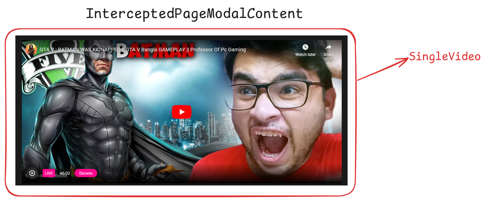
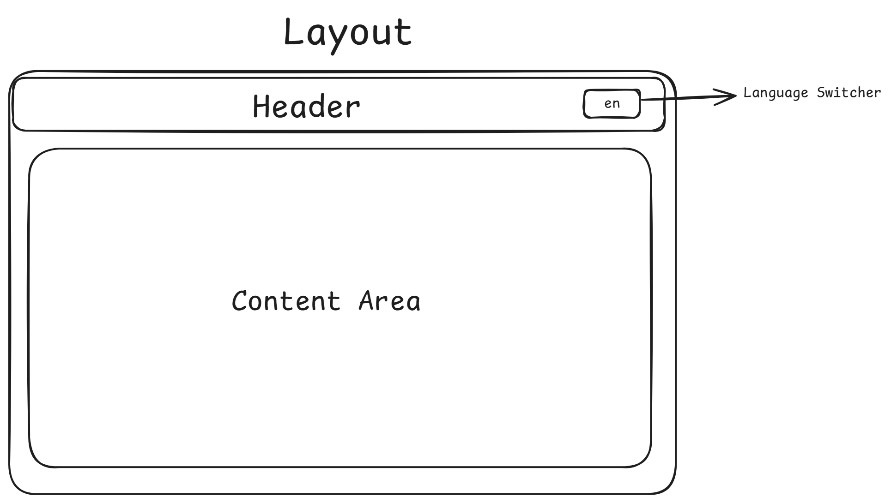

## LWS Xstream - Video Streaming

#### This is an Assignment project of [Learn With Sumit](https://learnwithsumit.com) Reactive Accelarator Batch 2 Module 8 - Assignment 7.

---

**This Assignment has two part**

-   Backend (Api Development)
-   Frontend

**I have completed the both part**
Click below link to see API Documentation

[API Documentation](./API-DOCUMENTATION.md)

Click below link to see Live Frontend Site

[See Live](https://lws-x-stream.vercel.app/)

---

## Requirement Analysis

**API development / Backend Part**

-   [x] আপনাদের 'dist/data' ফোল্ডার এর সাথে videos.js নামে একটি ফাইল রয়েছে। সেখানে কিছু ভিডিওর লিস্ট রয়েছে । সেই ভিডিও লিস্ট গুলো দিয়ে আপনাকে API বানাতে হবে । আমরা যেন '/api/videos' এই endpoint এ GET Request করলে সব গুলো ভিডিও দেখতে পারি । **এই API UI এর সাথে কানেক্ট করার প্রয়োজন নেই ।**

-   [x] আপনাদের আরো একটি API Endpoint বানাতে হবে । আপনার endpoint হবে এমন - '/api/videos/{id}' । এই Endpoint এ id দিয়ে GET রিকুয়েস্ট করলে সেই id এর ভিডিও Object নিয়ে এসে দেখাবে । **এই API UI এর সাথে কানেক্ট করার প্রয়োজন নেই ।**

-   [x] আপনার '/api/videos/{id}' Endpoint এ PATCH রিকুয়েস্ট করলে ভিডিও এর 'title' এবং 'description' প্রোপার্টি এর ভ্যালু পরিবর্তন করা যাবে, সেক্ষেত্রে রিকুয়েস্ট এর Response এ যেন Updated Data পাওয়া যায় । অর্থাৎ যদি 'title' প্রোপার্টি পরিবর্তন করা হয়, সেক্ষেত্রে Updated Title সহ পুরো Video Object কে যেন রেসপন্স হিসেবে পাওয়া যায় । Error হ্যান্ডেলিং এর ক্ষেত্রেও, খেয়াল রাখতে হবে । অর্থাৎ কেউ যদি 'title' বা 'description' এর পরিবর্তে অন্য কোনো ফিল্ড/প্রোপার্টি পরিবর্তন করতে চায়। সেক্ষেত্রে Error দিতে হবে । **এই API UI এর সাথে কানেক্ট করার প্রয়োজন নেই ।**

-   [x] একই Endpoint এ DELETE রিকুয়েস্ট করলে ভিডিও Delete হয়ে যাবে । **এই API UI এর সাথে কানেক্ট করার প্রয়োজন নেই ।**

**Frontend Developement / UI Part**

-   [x] আপনাদের দেয়া 'videos.js' ফাইল এর ডেটা গুলো, Dynamically import করে নিয়ে এসে UI তে ভিডিও কার্ড আকারে দেখাতে হবে । যেহেতু আমরা Next.js এ fetch করা বোঝাই নি, সেহেতু আপনি fetch/axios ব্যবহার করতে পারবেন না। আপনাকে Dynamically import করে নিয়ে এসেই দেখাতে হবে । এখানে **Dynamic import** করাটা গুরুত্বপূর্ণ। কিভাবে কোনো json file কে ডাইনামিকভাবে ইম্পোর্ট করা যায় সেটি মডিউল এর একটি ভিডিওতে দেখানো হয়েছে।

-   [x] প্রতিটা ভিডিও কার্ডে ক্লিক করলে, Video Details Modal ওপেন হবে এবং URL Route দেখতে হবে এমন - '/videos/:videoId' । অর্থাৎ যেই ভিডিও Modal ওপেন হবে, তার আইডি URL এ দেখা যাবে । সেই সাথে **Parallel Routing** এবং **Intercepting Routing** ইমপ্লিমেন্ট করতে হবে, যেন **নেভিগেশন** করে কার্ড এ ক্লিক করলে মোডাল ওপেন হয় আর পেজ রিলোড করলে সেটি যেন একটি আলাদা পেজ আকারে দেখা যায় ।

-   [x] Application এ যদি এমন কোনো রাউটে যাওয়া হয় যেই রাউট exist করে না, তাহলে Not Found পেজ দেখাতে হবে । আর যদি ভিডিও ডিটেইলস রাউটের এমন id দিয়ে পেজ রিকুয়েস্ট করা হয়, যেই আইডি দিয়ে কোনো ভিডিও নেই, সে ক্ষেত্রে আপনাকে এই মেসেজ দেখাতে হবে - "This video with {videoId} id was not found!" তার মানে আপনাকে কমন একটি Not found page বানাতে হবে এবং single video এর জন্য আলাদা not found page বানাতে হবে।

-   [x] পুরো এসাইনমেন্ট টি তে আপনাদের Multi-language ইমপ্লিমেন্ট করতে হবে । দুটি language support করাতে হবে। বাংলা এবং ইংরেজি দুটি Language json ফাইল আপনাদের নিজেদের বানিয়ে নিতে হবে । Navbar এ language পরিবর্তন করার জন্যে একটি অপশন বানাতে হবে আপনাদের এবং ব্রাউজারের ডিফল্ট language preference অনুযায়ী প্রথম অবস্থায় auto language select করতে হবে যেভাবে মডিউলে দেখানো হয়েছে।

## Project Mapping

