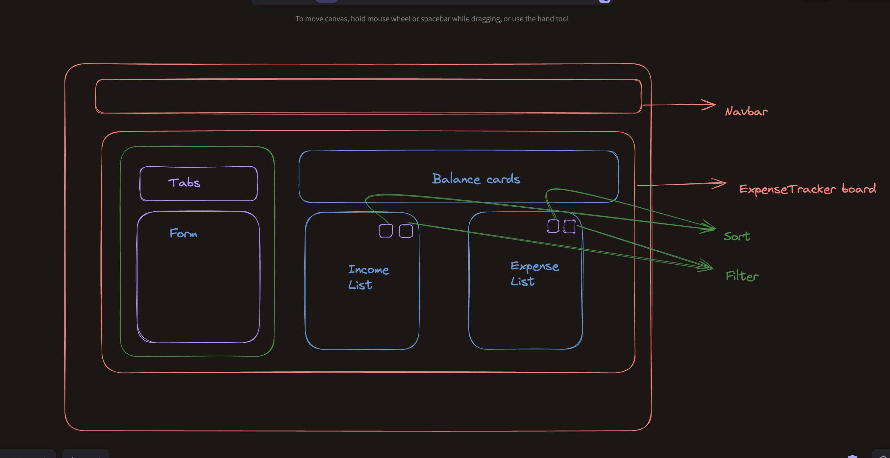
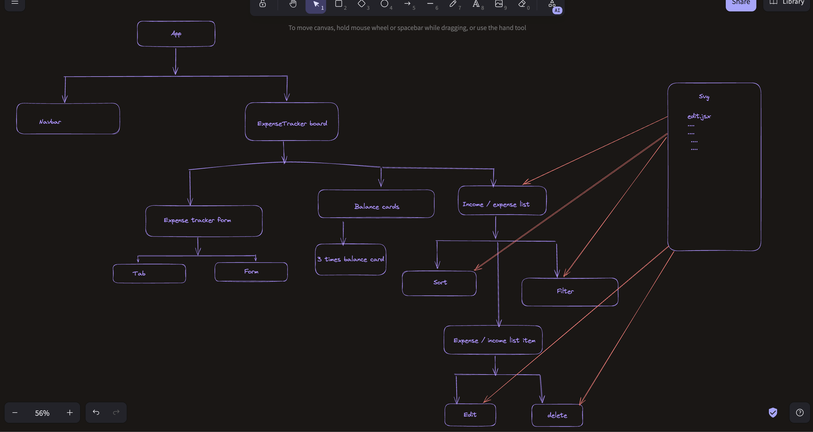

# Lws rnext assignment 2 - Expense Tracker

## Diagram

## component tree diagram

## Requirements analysis

- [x] বাম পাশের "Expense Tracker" ফর্ম ফিল-আপ করে সাবমিট করলে, Expense অথবা Income এর উপরে ভিত্তি করে ডানপাশের লিস্ট ভিউ এবং ব্যালেন্স সামারি আপডেট হবে ।

- [x] "Expense Tracker" ফর্ম এ ইউজার, Expense অথবা Income ট্যাব ভিউতে ক্লিক করে সিলেক্ট করতে পারবে তার ট্রান্সেকশন এর টাইপ, যেটি সিলেক্ট করবে সেটিতে 'active' ক্লাস থাকবে

- [x] Expense অথবা Income এর উপর ভিত্তি করে Category তে থাকা ক্যাটেগরি লিস্ট আপডেট হবে ।
      যদি Income সিলেক্ট করা থাকে তবে ক্যাটেগরি লিস্ট এ থাকবে - Salary, Outsourcing, Bond, Dividend ।
      আর যদি Expense সিলেক্ট করা থাকে তাহলে Education, Food, Health, Bill, Insurance, Tax, Transport, Telephone থাকবে ।

- [x] ব্যালেন্স সামারিতে Balance, Total Income, Total Expense আপডেট হতে থাকবে। অর্থাৎ যখনই কোনো নতুন ট্রান্সেকশন তৈরি হবে, তখনি Balance, Total Income, Total Expense আপডেট হবে । Total Income থেকে Total Expense বাদ দিলে যা হয়, তাই Balance এর ভ্যালু হবে।

- [x] Balance যদি কোনো কারণে নেগেটিভ এ চলে যায়, সেক্ষেত্রে লিখার রঙ লাল রঙ দিয়ে দেখাবে ।

- [x] Expense এবং Income লিস্ট দুটিই Sort করা যাবে । সর্টিং হবে এমাউন্ট এর ভিত্তি তে ।

- [x] Expense এবং Income দুটিই Filter করা যাবে । ফিল্টার হবে ক্যাটেগরি এর ভিত্তি তে । তবে খেয়াল রাখতে হবে "Expense Tracker" ফর্মের যেই Category গুলো রয়েছে, সেগুলোই যেন এখানেও রেন্ডার হয় । এবং ইনকাম লিস্টের ফিল্টার অপশনে যেন শুধু ইনকাম ক্যাটেগরি এবং এক্সপেন্স লিস্টের ফিল্টার অপশনে যেন শুধু এক্সপেন্স ক্যাটেগরি অপশন গুলোই থাকে । যদি কোনো ক্যাটেগরি সিলেক্ট করে দেয়া না থাকে, তবে সব গুলো দেখাবে ।

- [x] যেকোনো ট্রান্সেকশন "Edit" করার ফিচার দিতে হবে। অর্থাৎ ট্রান্সেকশন এর Amount এ Mouse Hover করলে সেখানে এডিট মেনু দেখাবে, "Edit" মেনুতে ক্লিক করলে, এই ট্রান্সেকশন এর সব ডেটা "Expense Tracker" ফর্মে চলে যাবে । এবং সেখান থেকে আপডেট করা যাবে ।

- [x] "Edit" মতই ট্রান্সেকশন এর Amount এ Mouse Hover করলে সেখানে "Delete" মেনু দেখাবে। সেটিতে ক্লিক করলে, ট্রান্সেকশন টি ডিলেট হয়ে যাবে ।

- [x] ট্রান্সেকশন Edit বা Delete করলে, ব্যালেন্স সামারি এর ব্যালেন্স গুলো যথাযত আপডেট হয়ে যাবে ।
